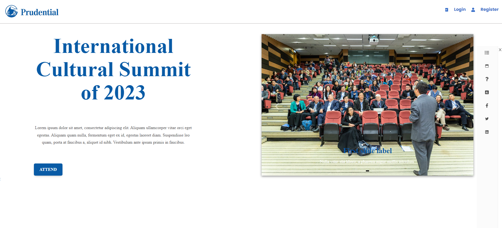
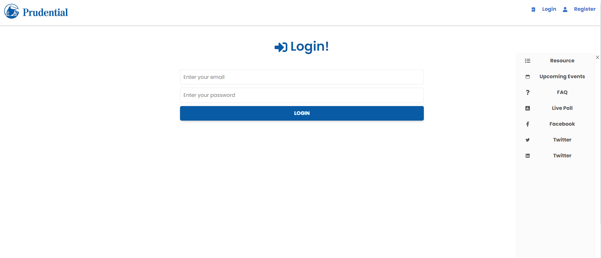
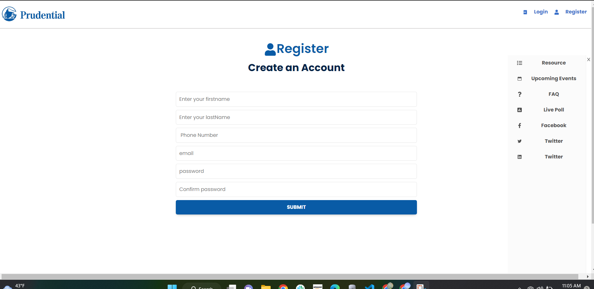
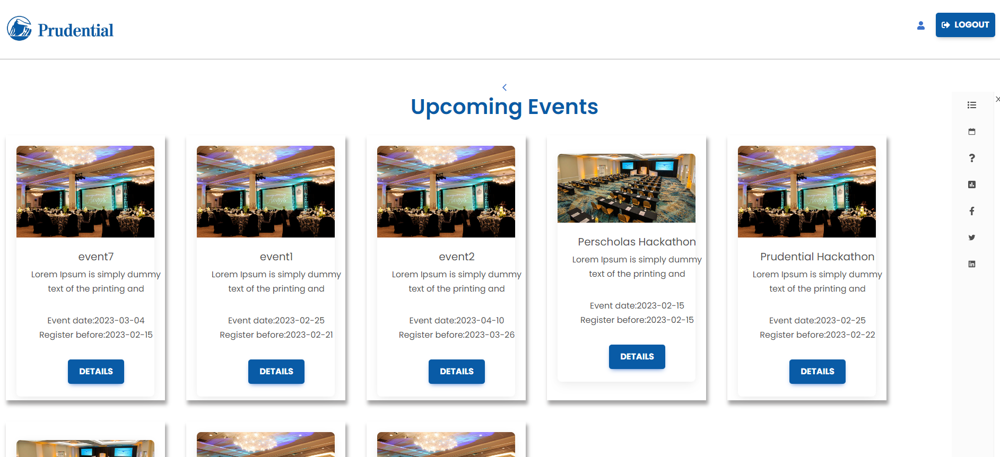
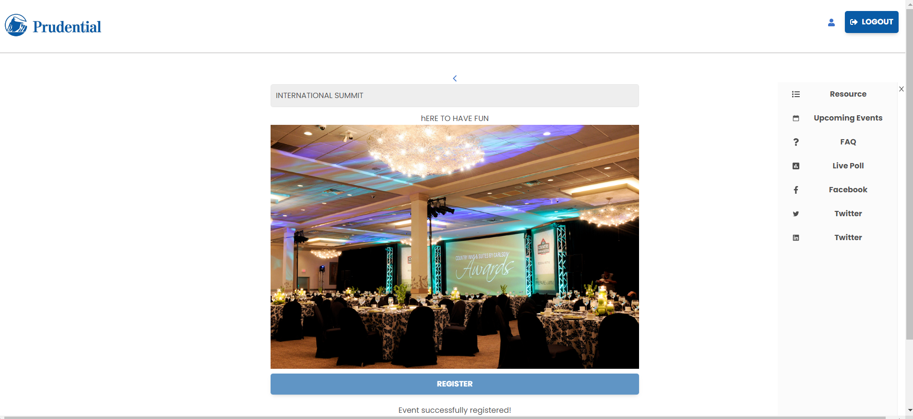

# Get the latest snapshot
git clone https://github.com/rvp15/ps_hackathon_copy.git 

# Change directory
cd ps_hackathon_co

# Install NPM dependencies
npm install for clent and serevr separately

# Then simply start your app
Command : npm start (for both client and server)

# Problem Statement 
 Build an Event Management Application to keep track of local events conducted by Prudential financial solutions.

 # Goals
 - Events schedules
 - Supplemental sessions materials
 - Social media fetch
 - Social Q&A and live polling
 - Push notifications
 - Digital content library
 - Interactive feedback

Application Layout:
- Home Page

- Login Page

- New Client Registration Page

- Upcoming Events

- Register for an event
